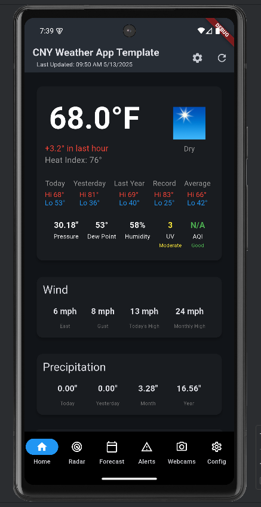
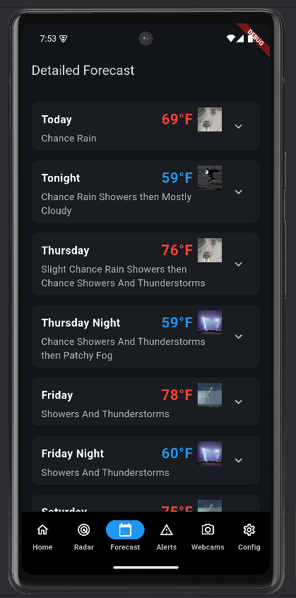
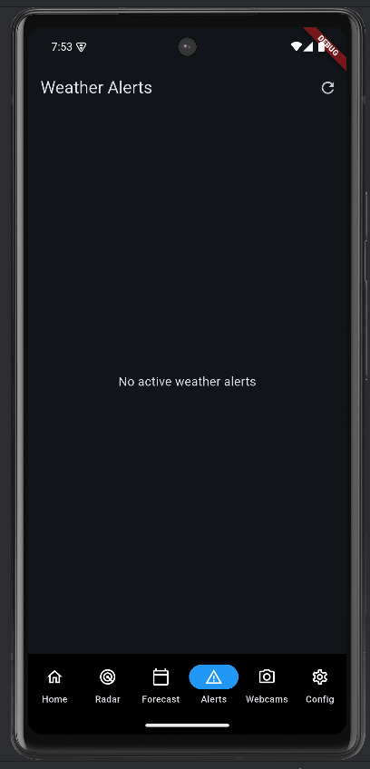
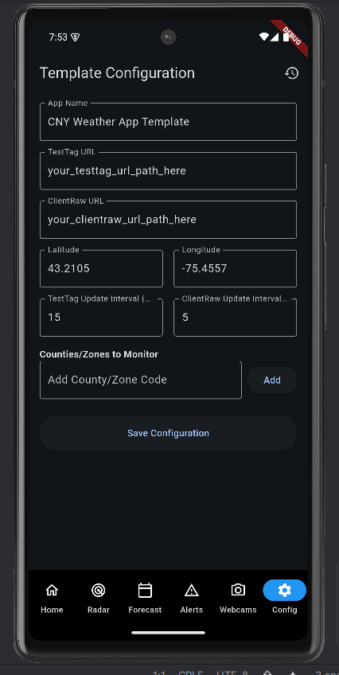

# CNY Weather App

A weather application for Central New York that provides real-time weather data, forecasts, and weather alerts for multiple counties.

## Features

- Real-time weather conditions
- Detailed forecasts
- Weather alerts and notifications
- County-specific monitoring
- Beautiful and intuitive UI

## Screenshots

### Home Screen


### Forecast Screen


### Advisories Screen


### Settings Screen


## Monitored Counties

- the counties you choose

## Data Sources

- National Weather Service
- your weather station

## Getting Started

1. Clone the repository
2. Install dependencies:
   ```bash
   flutter pub get
   ```
3. Run the app:
   ```bash
   flutter run
   ```

## Requirements

- Flutter SDK
- Android Studio / VS Code
- Android SDK
- iOS development tools (for iOS development)

## Version

Current version: 1.1.0

## License

This project is licensed under the MIT License - see the LICENSE file for details.
